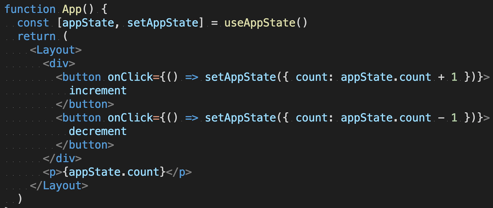

# React AppState [](https://circleci.com/gh/ryota-murakami/react-appstate) [](https://depfu.com/github/ryota-murakami/react-appstate?project_id=9896) [](https://github.com/facebook/jest) [](https://github.com/prettier/prettier) [](#contributors)

> 🌏 React Global AppState for Sharing Data between each components Built on Context.



<!-- START doctoc generated TOC please keep comment here to allow auto update -->
<!-- DON'T EDIT THIS SECTION, INSTEAD RE-RUN doctoc TO UPDATE -->

  - [Usage](#usage)
  - [Why](#why)
  - [Resources](#resources)
  - [Installation](#installation)
  - [API](#api)
    - [`<Provider appState={AppState} />`](#provider-appStateappState-)
    - [`const [appState, setAppState] = useAppState()`](#const-appState-setappState--useappState)
  - [Get value from `appState`](#get-value-from-appState)
    - [update appState with `setAppState(appState: Object)`](#update-appState-with-setappStateappState-object)
  - [Advanced](#advanced)
  - [TypeScript](#typescript)
    - [Example](#example-1)
  - [LICENSE](#license)
  - [Contributors](#contributors)

<!-- END doctoc generated TOC please keep comment here to allow auto update -->

## Usage

```js
// index.js
import React, { Fragment } from 'react'
import ReactDOM from 'react-dom'
import Provider, { useAppState } from '@ryotamurakami/react-appstate'
 
// initialAppState must be Plain Object
const initialAppState = { count: 0 }
 
ReactDOM.render(
  <Provider appState={initialAppState}>
    <App />
  </Provider>,
  document.getElementById('root')
)
 
function App() {
  const [appState, setAppState] = useAppState()

  return (
    <Fragment>
      <div>
        <button onClick={() => setAppState({ count: appState.count + 1 })}>increment</button>
        <button onClick={() => setAppState({ count: appState.count - 1 })}>decrement</button>
      </div>
      <p>I have {appState.apple.count} apples </p>
    </Fragment>
  )
}
```

## Play 👇

[](https://codesandbox.io/s/react-appstate-exampe-oreg7?fontsize=14)

<a href="https://codesandbox.io/s/react-appstate-example-oreg7"></a>

[https://react-appstate-demo.netlify.com/](https://react-appstate.netlify.com/) Same code as above usage's one.

## Why

I wanted a sharable state over the component hierarchy that could be setup immediately (in one shot). The goal was to have something similar to a **global version of `setState()`** with a simple interface.

Although there are many similar libraries and blog posts with code examples, they tended to be unnecessarily complicated / difficult to reuse. React AppState is awesome for prototyping, experimenting, and developing small apps.

Now, the`setAppState()` custom hook is packed it as an npm package to make setup one shot anywhere! 🍸

## Resources

- [React + TypeScript Cheatsheets](https://github.com/typescript-cheatsheets/react-typescript-cheatsheet#example-app): Example App [React TypeScript Todo Example 2019](https://github.com/ryota-murakami/react-typescript-todo-example-2019) is created with react-appstate.

## Installation

```
npm install @ryotamurakami/react-appstate
```

## API

### `<Provider appState={AppState} />`

+ Make your AppState as a plain Javascript Object.(eg: `const GlobalStaate = {foo: "bar"}`)
+ Wrap Provider in your root app component.
```js
import Provider from '@ryotamurakami/react-appstate'

// initialAppState must be Plain Object
const initialAppState = { count: 0 }

ReactDOM.render(
  <Provider appState={initialAppState}>
    <App />
  </Provider>,
  document.getElementById('root')
```

### `const [appState, setAppState] = useAppState()`

+ Gives interface to access and set the global appState.

##### Get value from `appState`

```js
// example
import { useAppState } from '@ryotamurakami/react-appstate'

const AppleComponent = () => {
  const [appState, setAppState] = useAppState()
  
  return (<div><{appState.thisIsMyValue}/div>)
}
```

##### update appState with `setAppState(appState: Object)`

```js
// example
import { useAppState } from '@ryotamurakami/react-appstate'

const NintendoComponent = () => {
  const [appState, setAppState] = useAppState()
  const orderSmashBros = () => setAppState({sales: appState.sales + 1 })
  
  return (<button onClick={orderSmashBros}>You can not wait!!</button>)
}
```

## Advanced

This is an abstract example utilizing [custom Hooks](https://reactjs.org/docs/hooks-custom.html).

- **src/index.js**
```js
import React from 'react'
import ReactDOM from 'react-dom'
import Provider, { useAppState } from '@ryotamurakami/react-appstate'
import { Layout } from './style'
import useAction from './actions'

const initialAppState = { count: 0 }
ReactDOM.render(
  <Provider appState={initialAppState}>
    <App />
  </Provider>,
  document.getElementById('root')
)

function App() {
  const action = useAction()
  return (
    <Layout>
      <div>
        <button onClick={action.increment}>increment</button>
        <button onClick={action.decrement}>decrement</button>
      </div>
      <p>{useAppState().appState.count}</p>
    </Layout>
  )
}
```

- **src/actions.js**
```js
import { useAppState } from '@ryotamurakami/react-appstate'

function useAction() {
  const [appState, setAppState] = useAppState()

  const Action = {}
  Action.increment = () => setAppState({ count: appState.count + 1 })
  Action.decrement = () => setAppState({ count: appState.count - 1 })

  return Action
}

export default useAction
```

### Multiple AppStates

**・Play 👇**

[](https://codesandbox.io/s/react-appstate-multiple-appState-example-zwqxd?fontsize=14)

## TypeScript

This package contains an `index.d.ts` type definition file, so you can use it in TypeScript without extra configuration.

### Example

```typescript
import React, { ReactElement } from 'react'
import ReactDOM from 'react-dom'
import Provider, { useAppState } from '@ryotamurakami/react-appstate'

interface Food {
  id: string
  name: string
}

type TodoList = Todo[]

interface AppState {
  FoodList: FoodList
}

let initialAppState: AppState = {
  foodList: []
}

const App = () => {
const [appState, setAppState] = useAppState<AppState>() // pass appState object type as generic
const item1: Food = {id: 'j4i3t280u', name: 'Hamburger'}
const item2: Food = {id: 'f83ja0j2t', name: 'Fried chicken'}
setAppState({foodList: [item1, item2]})

const foodListView: ReactElement[] = appState.foodList.map((f: Food) => <p key={f.id}>{f}</p>)

return (<div>{foodListView}</div>)
}

ReactDOM.render(
    <Provider appState={initialAppState}>
      <App>
    </Provider>,
  document.getElementById('root')
)
```

## LICENSE

MIT

## Contributors

Thank you to all these wonderful people ([emoji key](https://github.com/kentcdodds/all-contributors#emoji-key)):
I want to improve this library (especially stability) and your contribution is so helpful!

<!-- ALL-CONTRIBUTORS-LIST:START - Do not remove or modify this section -->
<!-- prettier-ignore -->
<table>
  <tr>
    <td align="center"><a href="http://ryota-murakami.github.io/"><br /><sub><b>ryota-murakami</b></sub></a><br /><a href="https://github.com/ryota-murakami/react-appstate/commits?author=ryota-murakami" title="Code">💻</a> <a href="https://github.com/ryota-murakami/react-appstate/commits?author=ryota-murakami" title="Documentation">📖</a> <a href="https://github.com/ryota-murakami/react-appstate/commits?author=ryota-murakami" title="Tests">⚠️</a></td>
    <td align="center"><a href="https://github.com/jackHedaya"><br /><sub><b>Jack Hedaya</b></sub></a><br /><a href="https://github.com/ryota-murakami/react-appstate/commits?author=jackHedaya" title="Documentation">📖</a></td>
  </tr>
</table>

<!-- ALL-CONTRIBUTORS-LIST:END -->

This project follows the [all-contributors](https://github.com/kentcdodds/all-contributors) specification. Contributions of any kind are welcome!
