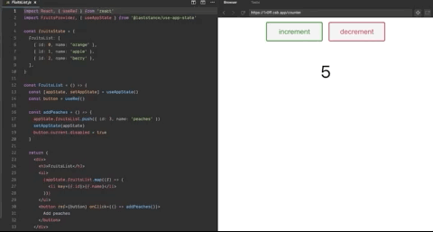

# @laststance/use-app-state

  [](https://depfu.com/github/laststance/use-app-state?project_id=9896) [](https://github.com/facebook/jest) [](https://github.com/prettier/prettier) [](#contributors)

> 🌏 useAppState() hook. that global version of setState() built on useContext.

<!-- START doctoc generated TOC please keep comment here to allow auto update -->
<!-- DON'T EDIT THIS SECTION, INSTEAD RE-RUN doctoc TO UPDATE -->


- [😀 Usage](#-usage)
- [🤔 Why](#-why)
- [📺 Demo](#-demo)
- [💾 Installation](#-installation)
- [🛠 API](#%F0%9F%9B%A0-api)
  - [`<Provider initialState={AppState} />`](#provider-initialstateappstate-)
  - [`const [appState, setAppState] = useAppState()`](#const-appstate-setappstate--useappstate)
      - [Get value from `appState`](#get-value-from-appstate)
      - [update appState with `setAppState(appState: Object)`](#update-appstate-with-setappstateappstate-object)
- [📕 TypeScript](#-typescript)
  - [Example](#example)
- [LICENSE](#license)
- [Contributors](#contributors)

<!-- END doctoc generated TOC please keep comment here to allow auto update -->

## 😀 Usage

```jsx
// index.js
import React from 'react'
import ReactDOM from 'react-dom'
import AppStateRoot, { useAppState } from '@laststance/use-app-state'

// initialState must be Plain Object
const initialState = { count: 0 }

ReactDOM.render(
  <AppStateRoot initialState={initialState}>
    <App />
  </AppStateRoot>,
  document.getElementById('root')
)

function App() {
  const [appState, setAppState] = useAppState()

  const increment = () => setAppState({ count: appState.count + 1 })
  const decrement = () => setAppState({ count: appState.count - 1 })

  return (
    <div>
      <button onClick={increment}>increment</button>
      <button onClick={decrement}>decrement</button>
      <p>I have {appState.count} apples </p>
    </div>
  )
}
```

## 🤔 Why

I wanted **just global version of `setState()`** in some projects.
So I setup code with `useState()`and `useContext()` then export `useAppState()` hook.
Finally added test, TypeScript support with published on npm. 🤗

There is no special things against generally kind of `useContext()` hook based global store.

## 📺 Demo

[](https://codesandbox.io/s/use-app-state-exampe-oreg7?fontsize=14)

<a href="https://codesandbox.io/s/use-app-state-example-oreg7"></a>

## 💾 Installation

```sh
npm install @laststance/use-app-state
```

or

```sh
yarn add @laststance/use-app-state
```

## 🛠 API

### `<Provider initialState={AppState} />`

- Make your AppState as a plain Javascript Object.(eg: `const AppState = {foo: "bar"}`)
- Wrap Provider in your root app component.

```jsx
import /* Provider is default exported. So any available whatever you want */ StateWrapper from '@laststance/use-app-state'

// initialAppState must be Plain Object
const initialState = { count: 0 }

ReactDOM.render(
  <StateWrapper initialState={initialState}>
    <App />
  </StateWrapper>,
  document.getElementById('root')
)
```

### `const [appState, setAppState] = useAppState()`

- Gives interface to access and set the global appState.

##### Get value from `appState`

```jsx
import { useAppState } from '@laststance/use-app-state'

const AppleComponent = () => {
  const [appState, setAppState] = useAppState()

  return <div>{appState.thisIsMyValue}</div>
}
```

##### update appState with `setAppState(appState: Object)`

```jsx
import { useAppState } from '@laststance/use-app-state'

const NintendoComponent = () => {
  const [appState, setAppState] = useAppState()
  const orderSmashBros = () => setAppState({ sales: appState.sales + 1 })

  return <button onClick={orderSmashBros}>You can not wait!!</button>
}
```

## 📕 TypeScript

This package contains an `index.d.ts` type definition file, so you can use it in TypeScript without extra configuration.

### Example

```tsx
import React, { ReactElement } from 'react'
import ReactDOM from 'react-dom'
import Provider, { useAppState } from '@laststance/use-app-state'

interface Food {
  id: string
  name: string
}

type TodoList = Todo[]

interface AppState {
  FoodList: FoodList
}

let initialAppState: AppState = {
  foodList: []
}

const App = () => {
const [appState, setAppState] = useAppState<AppState>() // pass appState object type as generic
const item1: Food = {id: 'j4i3t280u', name: 'Hamburger'}
const item2: Food = {id: 'f83ja0j2t', name: 'Fried chicken'}
setAppState({foodList: [item1, item2]})

const foodListView: ReactElement[] = appState.foodList.map((f: Food) => <p key={f.id}>{f}</p>)

return (<div>{foodListView}</div>)
}

ReactDOM.render(
    <Provider initialState={initialAppState}>
      <App>
    </Provider>,
  document.getElementById('root')
)
```

## LICENSE

MIT

## Contributors

Thank you to all these wonderful people ([emoji key](https://github.com/kentcdodds/all-contributors#emoji-key)):
I want to improve this library (especially stability) and your contribution is so helpful!

<!-- ALL-CONTRIBUTORS-LIST:START - Do not remove or modify this section -->
<!-- prettier-ignore -->
<table>
  <tr>
    <td align="center"><a href="http://ryota-murakami.github.io/"><br /><sub><b>ryota-murakami</b></sub></a><br /><a href="https://github.com/ryota-murakami/use-app-state/commits?author=ryota-murakami" title="Code">💻</a> <a href="https://github.com/ryota-murakami/use-app-state/commits?author=ryota-murakami" title="Documentation">📖</a> <a href="https://github.com/ryota-murakami/use-app-state/commits?author=ryota-murakami" title="Tests">⚠️</a></td>
    <td align="center"><a href="https://github.com/jackHedaya"><br /><sub><b>Jack Hedaya</b></sub></a><br /><a href="https://github.com/ryota-murakami/use-app-state/commits?author=jackHedaya" title="Documentation">📖</a></td>
  </tr>
</table>

<!-- ALL-CONTRIBUTORS-LIST:END -->

This project follows the [all-contributors](https://github.com/kentcdodds/all-contributors) specification. Contributions of any kind are welcome!
