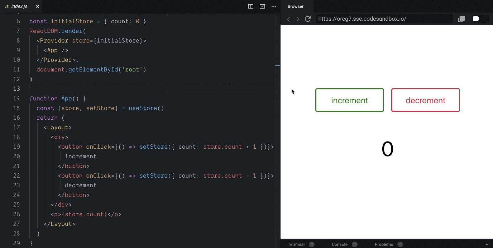

# muriatic [](https://circleci.com/gh/ryota-murakami/muriatic) [](https://github.com/facebook/jest) [](https://github.com/facebook/jest) [](https://github.com/prettier/prettier) [](#contributors) [](https://app.netlify.com/sites/muriatic/deploys)

> `const [store, setStore] = useStore()` One Shot React Data Sharing🍸



<!-- START doctoc generated TOC please keep comment here to allow auto update -->
<!-- DON'T EDIT THIS SECTION, INSTEAD RE-RUN doctoc TO UPDATE -->

  - [Usage](#usage)
  - [Installation](#installation)
  - [API](#api)
    - [`<Provider store={Store>} />`](#provider-storestore-)
    - [`const [store, setStore] = useStore()`](#const-store-setstore--usestore)
  - [Get value from `store`](#get-value-from-store)
    - [update store with `setStore(store: Object)`](#update-store-with-setstorestore-object)
  - [Advanced](#advanced)
  - [TypeScript](#typescript)
    - [Example](#example-1)
  - [LICENSE](#license)
  - [Contributors](#contributors)

<!-- END doctoc generated TOC please keep comment here to allow auto update -->

## Usage

```js
// index.js
import React from 'react'
import ReactDOM from 'react-dom'
import { Layout } from './style'
import Provider, { useStore } from 'muriatic'
 
// initialStore must be Plain Object
const initialStore = { count: 0 }
 
ReactDOM.render(
  <Provider store={initialStore}>
    <App />
  </Provider>,
  document.getElementById('root')
)
 
function App() {
  const [store, setStore] = useStore()

  return (
    <Layout>
      <div>
        <button onClick={() => setStore({ count: store.count + 1 })}>increment</button>
        <button onClick={() => setStore({ count: store.count - 1 })}>decrement</button>
      </div>
      <p>I have {store.apple.count} apple </p>
    </Layout>
  )
}
```

### Play 👇

[](https://codesandbox.io/s/muriatic-exampe-oreg7?fontsize=14)

[https://muriatic-demo.netlify.com/](https://muriatic.netlify.com/)

## Installation
```
npm install muriatic
```

## API
### `<Provider store={Store>} />`
Make your GrobalStore as a PlainObject.(eg: `const GlobalStaate = {foo: "bar"}`)  
And Wrap Provider in your root app component.
```js
import Provider from 'muriatic'

// initialStore must be Plain Object
const initialStore = { count: 0 }

ReactDOM.render(
  <Provider store={initialStore}>
    <App />
  </Provider>,
  document.getElementById('root')
```

### `const [store, setStore] = useStore()`

This is completely similar to React built-in hook such as [useState()](https://reactjs.org/docs/hooks-overview.html#state-hook).  
`store` left value is store object.
And `setStore` right value is update function.

## Get value from `store`
```js
// example
import { useStore } from 'muriatic'

const AppleComponent = () => {
  const [store, setStore] = useStore()
  
  return (<div><{store.thisIsMyValue}/div>)
}
```

### update store with `setStore(store: Object)`

```js
// example
import { useStore } from 'muriatic'

const NINTENDOComponent = () => {
  const [store, setStore] = useStore()
  const orderSmashBros = () => setStore({sales: store.sales + 1 })
  
  return (<button onClick={orderSmashBros}>You can not wait!!</button>)
}
```

## Advanced
This is action abstraction example utilize [custom Hooks](https://reactjs.org/docs/hooks-custom.html).

- **src/index.js**
```js
import React from 'react'
import ReactDOM from 'react-dom'
import Provider, { useStore } from 'muriatic'
import { Layout } from './style'
import useAction from './actions'

const initialStore = { count: 0 }
ReactDOM.render(
  <Provider store={initialStore}>
    <App />
  </Provider>,
  document.getElementById('root')
)

function App() {
  const action = useAction()
  return (
    <Layout>
      <div>
        <button onClick={action.increment}>increment</button>
        <button onClick={action.decrement}>decrement</button>
      </div>
      <p>{useStore().store.count}</p>
    </Layout>
  )
}
```

- **src/actions.js**
```js
import { useStore } from 'muriatic'

function useAction() {
  const [store, setStore] = useStore()

  const Action = {}
  Action.increment = () => setStore({ count: store.count + 1 })
  Action.decrement = () => setStore({ count: store.count - 1 })

  return Action
}

export default useAction
```

### Multiple Store

[](https://codesandbox.io/s/muriatic-multiple-store-example-zwqxd?fontsize=14)

## TypeScript

This package contains `index.d.ts` type definition file, so you can use it in TypeScript without extra setting.

### Example

```typescript
import React, { ReactElement } from 'react'
import ReactDOM from 'react-dom'
import Provider, { useStore } from 'muriatic'

interface Food {
  id: string
  name: string
}

type TodoList = Todo[]

interface Store {
  FoodList: FoodList
}

let initialStore: Store = {
  foodList: []
}

const App = () => {
const [store, setStore] = useStore<Store>() // pass store object type to generics
const item1: Food = {id: 'j4i3t280u', name: 'Hamburger'}
const item2: Food = {id: 'f83ja0j2t', name: 'Fried chicken'}
setStore({foodList: [item1, item2]})

const foodListView: ReactElement[] = store.foodList.map((f: Food) => <p key={f.id}>{f}</p>)

return (<div>{foodListView}</div>)
}

ReactDOM.render(
    <Provider store={initialStore}>
      <App>
    </Provider>,
  document.getElementById('root')
)
```

## LICENSE
MIT

## Contributors

Thanks goes to these wonderful people ([emoji key](https://github.com/kentcdodds/all-contributors#emoji-key)):
I want to implove this library(espesialy stability), your contribute is so helpful!

<!-- ALL-CONTRIBUTORS-LIST:START - Do not remove or modify this section -->
<!-- prettier-ignore -->
<table>
  <tr>
    <td align="center"><a href="http://ryota-murakami.github.io/"><br /><sub><b>ryota-murakami</b></sub></a><br /><a href="https://github.com/ryota-murakami/muriatic/commits?author=ryota-murakami" title="Code">💻</a> <a href="https://github.com/ryota-murakami/muriatic/commits?author=ryota-murakami" title="Documentation">📖</a> <a href="https://github.com/ryota-murakami/muriatic/commits?author=ryota-murakami" title="Tests">⚠️</a></td>
    <td align="center"><a href="https://github.com/jackHedaya"><br /><sub><b>Jack Hedaya</b></sub></a><br /><a href="https://github.com/ryota-murakami/muriatic/commits?author=jackHedaya" title="Documentation">📖</a></td>
  </tr>
</table>

<!-- ALL-CONTRIBUTORS-LIST:END -->

This project follows the [all-contributors](https://github.com/kentcdodds/all-contributors) specification. Contributions of any kind welcome!
